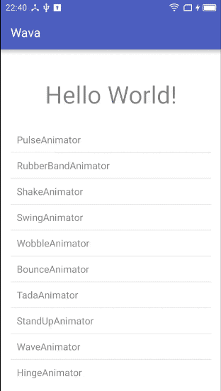

[](http://android-arsenal.com/details/1/3663)

### wava

> Wow, Android View Animation!

我想写一个很好用的Android动画制作库，具体如何做目前还在思考中 🐈

目前做的最好的Android动画库项目是[@代码家](https://github.com/daimajia)的[AndroidViewAnimations](https://github.com/daimajia/AndroidViewAnimations)，这个项目真的非常棒。   
项目`wava`目前只是参考这个项目并对其代码进行修改和改进，后期我将添加更多有意思的功能。    
具体什么功能请大家期待下吧，感兴趣的话可以关注这个项目哈 😜

[When Math Meets Animation(1)](https://javayhu.github.io/blog/2016-05-26-when-math-meets-android-animation-1)    
[When Math Meets Animation(2)](https://javayhu.github.io/blog/2016-05-27-When-Math-meets-Android-Animation-2)     
[When Math Meets Animation(3)](https://javayhu.github.io/blog/2016-05-28-When-Math-meets-Android-Animation-3)     

### Sample



### Usage

和原项目的使用方式基本相同

```java
YoYo.with(technique).duration(1200)
    .interpolate(new AccelerateDecelerateInterpolator())
    .listen(new AnimatorListenerAdapter() {
        @Override
        public void onAnimationCancel(Animator animation) {
                Toast.makeText(MainActivity.this, "canceled", Toast.LENGTH_SHORT).show();
        }
    })
    .playOn(mTarget);
```

### Setup

1.在项目根目录的build.gradle文件中加入

```
allprojects {
    repositories {
        ...
        maven { url "https://www.jitpack.io" }
    }
}
```

2.然后在需要的build.gradle文件中加入依赖

```
dependencies {
    compile 'com.github.hujiaweibujidao:wava:1.0.0'
}
```

### Changes 

目前主要修改和改进的地方：

1.去掉了过时的[NineOldAndroids](https://github.com/JakeWharton/NineOldAndroids)库（如果Android项目的`minSdkVersion="14"`可以直接使用系统提供的动画API）；

例如，动画恢复部分的代码就不再需要使用`ViewHelper`了

```java
public void reset() {
    mTarget.setAlpha(1);
    mTarget.setScaleX(1);
    mTarget.setScaleY(1);
    mTarget.setTranslationX(0);
    mTarget.setTranslationY(0);
    mTarget.setRotation(0);
    mTarget.setRotationX(0);
    mTarget.setRotationY(0);
    mTarget.setPivotX(mTarget.getMeasuredWidth() / 2.0f);
    mTarget.setPivotY(mTarget.getMeasuredHeight() / 2.0f);
}
```

2.大幅度精简了核心类`YoYo`（包括其中的`Builder`和`YoYoString`类）内部的代码，但是只做扩展，基本保持了原有接口不变；

```java
public static class Builder {

    private static final int DEFAULT_REPEAT = 1;//动画默认只播放一次
    private static final long DEFAULT_DELAY = 0;//动画默认没有启动延时
    private static final boolean DEFAULT_RESET = false;//动画结束默认不恢复原状
    private static final long DEFAULT_DURATION = 1000;//动画时间间隔默认是1秒

    private View target;//作用的view
    private long delay = DEFAULT_DELAY;//动画启动延迟
    private long duration = DEFAULT_DURATION;//动画持续时长
    private int repeat = DEFAULT_REPEAT;//动画重复次数
    private boolean reset = DEFAULT_RESET;//动画结束之后是否恢复到原来的状态，true表示恢复
    private BaseViewAnimator animator;//animator类
    private Interpolator interpolator;//interpolator 时间插值类
    private List<Animator.AnimatorListener> listeners = new ArrayList<Animator.AnimatorListener>();//动画的监听器

    //两个构造函数都将使得animator成为一个非空对象
    private Builder(Techniques technique) {
        this.animator = technique.getAnimator();
    }

    private Builder(BaseViewAnimator animator) {
        this.animator = animator;
    }

    public Builder duration(long duration) {
        this.duration = duration;
        return this;
    }

    public Builder delay(long delay) {
        this.delay = delay;
        return this;
    }

    public Builder interpolate(Interpolator interpolator) {
        this.interpolator = interpolator;
        return this;
    }

    public Builder listen(AnimatorListenerAdapter listener) {
        this.listeners.add(listener);
        return this;
    }

    public Builder reset(boolean reset) {
        this.reset = reset;
        return this;
    }

    public Builder repeat(int count) {
        this.repeat = count;
        return this;
    }

    //调用play表示动画正式开始，返回结果是可以控制动画的对象YoYoString
    public YoYoString playOn(View target) {
        this.target = target;
        start();
        return new YoYoString(this.animator);
    }

    //builder内部的start方法，将animatorset启动
    private void start() {
        animator.setTarget(target).setDuration(duration).setInterpolator(interpolator)
                .setStartDelay(delay).setRest(reset).setRepeat(repeat);

        if (listeners.size() > 0) {
            animator.addAllListeners(listeners);
        }

        animator.start();
    }
}
```

3.在`BaseViewAnimator`中对增加了动画重复播放、动画结束时恢复等功能的支持，使用方式依然和以前一样简单；

```java
public void start() {
    reset();
    prepare();
    if (mRepeat != 0) {
        for (Animator animator : mAnimatorSet.getChildAnimations()) {
            ((ValueAnimator) animator).setRepeatCount(mRepeat > 0 ? mRepeat - 1 : mRepeat);//区别无穷次
            //((ValueAnimator) animator).setRepeatMode(ValueAnimator.REVERSE);
        }
    }
    if (mRest) {
        mAnimatorSet.addListener(new AnimatorListenerAdapter() {
            @Override
            public void onAnimationEnd(Animator animation) {
                reset();
            }
        });
    }
    mAnimatorSet.start();
}
```

4.将原来依赖的[`AndroidEasingFunctions`](https://github.com/daimajia/AnimationEasingFunctions)替换成更加简单易用的[`yava`](https://github.com/hujiaweibujidao/yava)；

```java
public class LandingAnimator extends BaseViewAnimator {
    @Override
    protected void prepare() {
//        mAnimatorSet.playTogether(
//                Glider.glide(Skill.QuintEaseOut, mAnimatorSet.getDuration(), ObjectAnimator.ofFloat(mTarget, "scaleX", 1.5f, 1f)),
//                Glider.glide(Skill.QuintEaseOut, mAnimatorSet.getDuration(), ObjectAnimator.ofFloat(mTarget, "scaleY", 1.5f, 1f)),
//                Glider.glide(Skill.QuintEaseOut, mAnimatorSet.getDuration(), ObjectAnimator.ofFloat(mTarget, "alpha", 0, 1f))
//        );

        ObjectAnimator animator1 = ObjectAnimator.ofFloat(mTarget, "scaleX", 1.5f, 1f);
        animator1.setInterpolator(EasingFunction.QUINT_OUT);
        ObjectAnimator animator2 = ObjectAnimator.ofFloat(mTarget, "scaleY", 1.5f, 1f);
        animator2.setInterpolator(EasingFunction.QUINT_OUT);
        ObjectAnimator animator3 = ObjectAnimator.ofFloat(mTarget, "alpha", 0, 1f);
        animator3.setInterpolator(EasingFunction.QUINT_OUT);
        mAnimatorSet.playTogether(animator1, animator2, animator3);
    }
}
```

5.简化了`ViewAnimator`内部的调用`AnimatorSet`和`TargetView`的方式；

```java
public class BounceAnimator extends BaseViewAnimator {
    @Override
    public void prepare() {
        mAnimatorSet.playTogether(
                ObjectAnimator.ofFloat(mTarget, "translationY", 0, 0, -30, 0, -15, 0, 0)
        );
    }
}
```

6.复制了原有的动画演示代码，略有修改，但是保证了效果如初。

### License

```
The MIT License (MIT)

Copyright (c) 2016 Hujiawei

Permission is hereby granted, free of charge, to any person obtaining a copy
of this software and associated documentation files (the "Software"), to deal
in the Software without restriction, including without limitation the rights
to use, copy, modify, merge, publish, distribute, sublicense, and/or sell
copies of the Software, and to permit persons to whom the Software is
furnished to do so, subject to the following conditions:

The above copyright notice and this permission notice shall be included in all
copies or substantial portions of the Software.

THE SOFTWARE IS PROVIDED "AS IS", WITHOUT WARRANTY OF ANY KIND, EXPRESS OR
IMPLIED, INCLUDING BUT NOT LIMITED TO THE WARRANTIES OF MERCHANTABILITY,
FITNESS FOR A PARTICULAR PURPOSE AND NONINFRINGEMENT. IN NO EVENT SHALL THE
AUTHORS OR COPYRIGHT HOLDERS BE LIABLE FOR ANY CLAIM, DAMAGES OR OTHER
LIABILITY, WHETHER IN AN ACTION OF CONTRACT, TORT OR OTHERWISE, ARISING FROM,
OUT OF OR IN CONNECTION WITH THE SOFTWARE OR THE USE OR OTHER DEALINGS IN THE
SOFTWARE.
```

